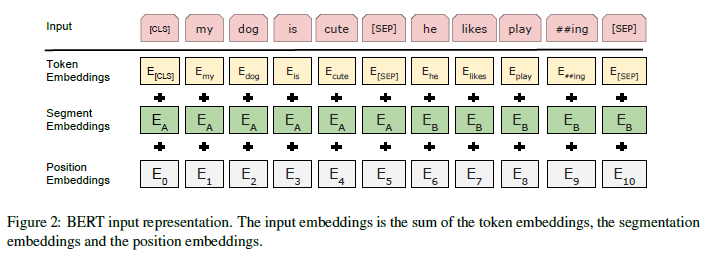

**BERT: Pre-training of Deep Bidirectional Transformers for Language Understanding 论文的中文翻译**

本资源完整的翻译了论文，并且给出了论文中所有引用资料的网络连接，方便对 BERT 感兴趣的朋友们进一步研究 BERT。

1. 原文 [BERT: Pre-training of Deep Bidirectional Transformers for Language Understanding](https://arxiv.org/abs/1810.04805v1)，这是BERT在2018年11月发布的版本，与2019年5月版本[v2](https://arxiv.org/abs/1810.04805v2)有稍许不同。
2. 以下内容是部分预览内容，完整内容查看本资源中的 [Bidirectional_Encoder_Representations_Transformers翻译.md](Bidirectional_Encoder_Representations_Transformers翻译.md)；
3. BERT论文翻译 [PDF版下载](BERT中文翻译PDF版.pdf)；
4. 转载请注明出处，商用请联系译者 袁宵 wangzichaochaochao@gmail.com；
5. 未来将继续翻译和解析深度学习相关论文，特别是 NLP 方向的论文。
6. 如果你喜欢我的工作，请点亮右上角星星，谢谢 :smiley:

---

手机扫码阅读：

---

# BERT：预训练的深度双向 Transformer 语言模型
Jacob Devlin；Ming-Wei Chang；Kenton Lee；Kristina Toutanova
Google AI Language
{jacobdevlin,mingweichang,kentonl,kristout}@google.com

> 图 1：预训练模型结构的不同。BERT 使用双向 Transformer。OpenAI GPT 使用 从左到右的 Transformer。ELMo 使用独立训练的从左到右和从右到左的 LSTM 的连接来为下游任务生成特征。其中，只有 BERT 表示在所有层中同时受到左右语境的制约。

> 图 2：BERT 的输入表示。输入嵌入是标记嵌入（词嵌入）、句子嵌入和位置嵌入的总和。

## 摘要
我们提出了一种新的称为 BERT 的语言表示模型，BERT 代表来自 Transformer 的双向编码器表示（**B**idirectional **E**ncoder **R**epresentations from **T**ransformers）。不同于最近的语言表示模型（[Peters et al., 2018](https://arxiv.org/abs/1802.05365v2)，[Radford et al., 2018](https://blog.openai.com/language-unsupervised/)）， BERT 旨在通过联合调节所有层中的左右上下文来预训练深度双向表示。因此，只需要一个额外的输出层，就可以对预训练的 BERT 表示进行微调，从而为广泛的任务（比如回答问题和语言推断任务）创建最先进的模型，而无需对特定于任务进行大量模型结构的修改。

BERT 的概念很简单，但实验效果很强大。它刷新了 11 个 NLP 任务的当前最优结果，包括将 GLUE 基准提升至 80.4%（7.6% 的绝对改进）、将 MultiNLI 的准确率提高到 86.7%（5.6% 的绝对改进），以及将 SQuAD v1.1 的问答测试 F1 得分提高至 93.2 分（提高 1.5 分）——比人类表现还高出 2 分。

## 1. 介绍
语言模型预训练可以显著提高许多自然语言处理任务的效果（[Dai and Le, 2015](http://papers.nips.cc/paper/5949-semi-supervised-sequence-learning)；[Peters et al., 2018](https://arxiv.org/abs/1802.05365v2)；[Radford et al., 2018](https://blog.openai.com/language-unsupervised/)；[Howard and Ruder, 2018](https://arxiv.org/abs/1801.06146v5)）。这些任务包括句子级任务，如自然语言推理（[Bow-man et al., 2015](https://arxiv.org/abs/1508.05326v1)；[Williams et al., 2018](https://arxiv.org/abs/1704.05426v4)）和释义（[Dolan and Brockett, 2005](https://www.researchgate.net/publication/228613673_Automatically_constructing_a_corpus_of_sentential_paraphrases)），目的是通过对句子的整体分析来预测句子之间的关系，以及标记级任务，如命名实体识别（[Tjong Kim Sang and De Meulder, 2003](http://www.oalib.com/paper/4018980)）和 SQuAD 问答（[Rajpurkar et al., 2016](https://arxiv.org/abs/1606.05250v3)），模型需要在标记级生成细粒度的输出。

现有的两种方法可以将预训练好的语言模型表示应用到下游任务中：基于特征的和微调。基于特征的方法，如 ELMo （[Peters et al., 2018](https://arxiv.org/abs/1802.05365v2))，使用特定于任务的模型结构，其中包含预训练的表示作为附加特特征。微调方法，如生成预训练 Transformer  (OpenAI GPT) （[Radford et al., 2018](https://blog.openai.com/language-unsupervised/)）模型，然后引入最小的特定于任务的参数，并通过简单地微调预训练模型的参数对下游任务进行训练。在之前的工作中，两种方法在预训练任务中都具有相同的目标函数，即使用单向的语言模型来学习通用的语言表达。

我们认为，当前的技术严重地限制了预训练表示的效果，特别是对于微调方法。主要的局限性是标准语言模型是单向的，这就限制了可以在预训练期间可以使用的模型结构的选择。例如，在 OpenAI GPT 中，作者使用了从左到右的模型结构，其中每个标记只能关注 Transformer 的自注意层中该标记前面的标记（[Williams et al., 2018](https://arxiv.org/abs/1704.05426v4)）。这些限制对于句子级别的任务来说是次优的（还可以接受），但当把基于微调的方法用来处理标记级别的任务（如 SQuAD 问答）时可能会造成不良的影响（[Rajpurkar et al., 2016](https://arxiv.org/abs/1606.05250v3)），因为在标记级别的任务下，从两个方向分析上下文是至关重要的。

在本文中，我们通过提出 BERT 改进了基于微调的方法：来自 Transformer 的双向编码器表示。受完形填空任务的启发，BERT 通过提出一个新的预训练任务来解决前面提到的单向约束：“遮蔽语言模型”（MLM masked language model）（[Tay-lor, 1953](https://www.researchgate.net/publication/232539913_Cloze_Procedure_A_New_Tool_For_Measuring_Readability)）。遮蔽语言模型从输入中随机遮蔽一些标记，目的是仅根据被遮蔽标记的上下文来预测它对应的原始词汇的 id。与从左到右的语言模型预训练不同，MLM 目标允许表示融合左右上下文，这允许我们预训练一个深层双向 Transformer。除了遮蔽语言模型之外，我们还提出了一个联合预训练文本对来进行“下一个句子预测”的任务。

本文的贡献如下：
+ 我们论证了双向预训练对语言表征的重要性。与 [Radford et al., 2018](https://blog.openai.com/language-unsupervised/) 使用单向语言模型进行预训练不同，BERT 使用遮蔽语言模型来实现预训练深层双向表示。这也与 [Peters et al., 2018](https://arxiv.org/abs/1802.05365v2) 的研究形成了对比，他们使用了一个由左到右和由右到左的独立训练语言模型的浅层连接。
+ 我们表明，预训练的表示消除了许多特定于任务的高度工程化的的模型结构的需求。BERT 是第一个基于微调的表示模型，它在大量的句子级和标记级任务上实现了最先进的性能，优于许多特定于任务的结构的模型。
+ BERT 为 11 个 NLP 任务提供了最先进的技术。我们还进行大量的消融研究，证明了我们模型的双向本质是最重要的新贡献。代码和预训练模型将可在 [goo.gl/language/bert](https://github.com/google-research/bert) 获取。

....

## 参考文献
所有参考文献按论文各小节中引用顺序排列，多次引用会多次出现在下面的列表中。

**Abstract 摘要中的参考文献**

|BERT 文中简写|原始标论文标题|其它|
|-|-|-|
|Peters et al., 2018|[Deep contextualized word representations](https://arxiv.org/abs/1802.05365v2)|ELMo|
|Radford et al., 2018|[Improving Language Understanding with Unsupervised Learning](https://blog.openai.com/language-unsupervised/)|OpenAI GPT|

**1. Introduction 介绍中的参考文献**

|BERT 文中简写|原始标论文标题|其它|
|-|-|-|
|Peters et al., 2018|[Deep contextualized word representations](https://arxiv.org/abs/1802.05365v2)|ELMo|
|Radford et al., 2018|[Improving Language Understanding with Unsupervised Learning](https://blog.openai.com/language-unsupervised/)|OpenAI GPT|
|Dai and Le, 2015|[Semi-supervised sequence learning. In Advances in neural information processing systems, pages 3079–3087](http://papers.nips.cc/paper/5949-semi-supervised-sequence-learning)|AndrewMDai and Quoc V Le. 2015|
|Howard and Ruder, 2018|[Universal Language Model Fine-tuning for Text Classification](https://arxiv.org/abs/1801.06146v5)|**ULMFiT**；Jeremy Howard and Sebastian Ruder.|
|Bow-man et al., 2015|[A large annotated corpus for learning natural language inference](https://arxiv.org/abs/1508.05326v1)|Samuel R. Bowman, Gabor Angeli, Christopher Potts, and Christopher D. Manning.|
|Williams et al., 2018|[A Broad-Coverage Challenge Corpus for Sentence Understanding through Inference](https://arxiv.org/abs/1704.05426v4)|Adina Williams, Nikita Nangia, and Samuel R Bowman.|
|Dolan and Brockett, 2005|[Automatically constructing a corpus of sentential paraphrases](https://www.researchgate.net/publication/228613673_Automatically_constructing_a_corpus_of_sentential_paraphrases)|William B Dolan and Chris Brockett. 2005.|
|Tjong Kim Sang and De Meulder, 2003|[Introduction to the CoNLL-2003 Shared Task: Language-Independent Named Entity Recognition](http://www.oalib.com/paper/4018980)|Erik F Tjong Kim Sang and Fien De Meulder. 2003.|
|Rajpurkar et al., 2016|[SQuAD: 100,000+ Questions for Machine Comprehension of Text](https://arxiv.org/abs/1606.05250v3)|SQuAD|
|Taylor, 1953|["Cloze Procedure": A New Tool For Measuring Readability](https://www.researchgate.net/publication/232539913_Cloze_Procedure_A_New_Tool_For_Measuring_Readability)|Wilson L Taylor. 1953.|

**2. Related Work 相关工作中的参考文献**

|BERT 文中简写|原始标论文标题|其它|
|-|-|-|
|Brown et al., 1992|[Class-based n-gram models of natural language](https://dl.acm.org/citation.cfm?id=176316)|Peter F Brown, Peter V Desouza, Robert L Mercer, Vincent J Della Pietra, and Jenifer C Lai. 1992.|
|Ando and Zhang, 2005|[A Framework for Learning Predictive Structures from Multiple Tasks and Unlabeled Data](http://academictorrents.com/details/f4470eb8bc3a6f697df61bde319fd56e3a9d6733)|Rie Kubota Ando and Tong Zhang. 2005.|
|Blitzer et al., 2006|[Domain adaptation with structural correspondence learning](https://dl.acm.org/citation.cfm?id=1610094)|John Blitzer, Ryan McDonald, and Fernando Pereira.2006.|
|Collobert and Weston, 2008|[A Unified Architecture for Natural Language Processing](https://www.researchgate.net/publication/200044432_A_Unified_Architecture_for_Natural_Language_Processing)|Ronan Collobert and Jason Weston. 2008.|
|Mikolov et al., 2013|[Distributed Representations of Words and Phrases and their Compositionality](https://arxiv.org/abs/1310.4546v1)|CBOW Model；Skip-gram Model|
|Pennington et al., 2014|[GloVe: Global Vectors for Word Representation](http://www.aclweb.org/anthology/D14-1162)|GloVe|
|Turian et al., 2010|[Word Representations: A Simple and General Method for Semi-Supervised Learning](https://www.researchgate.net/publication/220873681_Word_Representations_A_Simple_and_General_Method_for_Semi-Supervised_Learning)|Joseph Turian, Lev Ratinov, and Yoshua Bengio. 2010.|
|Kiros et al., 2015|[Skip-Thought Vectors](https://arxiv.org/abs/1506.06726v1)|Skip-Thought Vectors|
|Logeswaran and Lee, 2018|[An efficient framework for learning sentence representations](https://arxiv.org/abs/1803.02893v1)|Lajanugen Logeswaran and Honglak Lee. 2018.|
|Le and Mikolov, 2014|[Distributed Representations of Sentences and Documents](https://arxiv.org/abs/1405.4053v2)|Quoc Le and Tomas Mikolov. 2014.|
|Peters et al., 2017|[Semi-supervised sequence tagging with bidirectional language models](https://arxiv.org/abs/1705.00108v1)|Matthew Peters, Waleed Ammar, Chandra Bhagavatula, and Russell Power. 2017.|
|Peters et al., 2018|[Deep contextualized word representations](https://arxiv.org/abs/1802.05365v2)|ELMo|
|Rajpurkar et al., 2016|[SQuAD: 100,000+ Questions for Machine Comprehension of Text](https://arxiv.org/abs/1606.05250v3)|SQuAD|
|Socher et al., 2013|[Deeply Moving: Deep Learning for Sentiment Analysis](https://nlp.stanford.edu/sentiment/)|SST-2|
|Tjong Kim Sang and De Meulder, 2003|[Introduction to the CoNLL-2003 Shared Task: Language-Independent Named Entity Recognition](http://www.oalib.com/paper/4018980)|Erik F Tjong Kim Sang and Fien De Meulder. 2003.|
|Dai and Le, 2015|[Semi-supervised sequence learning. In Advances in neural information processing systems, pages 3079–3087](http://papers.nips.cc/paper/5949-semi-supervised-sequence-learning)|AndrewMDai and Quoc V Le. 2015|
|Howard and Ruder, 2018|[Universal Language Model Fine-tuning for Text Classification](https://arxiv.org/abs/1801.06146v5)|**ULMFiT**；Jeremy Howard and Sebastian Ruder.|
|Radford et al., 2018|[Improving Language Understanding with Unsupervised Learning](https://blog.openai.com/language-unsupervised/)|OpenAI GPT|
|Wang et al.(2018)|[GLUE: A Multi-Task Benchmark and Analysis Platform for Natural Language Understanding](https://arxiv.org/abs/1804.07461v2)|GLUE|
|Con-neau et al., 2017|[Supervised Learning of Universal Sentence Representations from Natural Language Inference Data](https://www.aclweb.org/anthology/D17-1070)|Alexis Conneau, Douwe Kiela, Holger Schwenk, Loic Barrault, and Antoine Bordes. 2017.|
|McCann et al., 2017|[Learned in Translation: Contextualized Word Vectors](https://einstein.ai/static/images/pages/research/cove/McCann2017LearnedIT.pdf)|Bryan McCann, James Bradbury, Caiming Xiong, and Richard Socher. 2017.|
|Deng et al.|[ImageNet: A large-scale hierarchical image database](https://ieeexplore.ieee.org/document/5206848)|J. Deng,W. Dong, R. Socher, L.-J. Li, K. Li, and L. FeiFei. 2009.|
|Yosinski et al., 2014|[How transferable are features in deep neural networks?](https://arxiv.org/abs/1411.1792v1)|Jason Yosinski, Jeff Clune, Yoshua Bengio, and Hod Lipson. 2014.|

**3. BERT 中的参考文献**

|BERT 文中简写|原始标论文标题|其它|
|-|-|-|
|Vaswani et al. (2017)|[Attention Is All You Need](https://arxiv.org/abs/1706.03762v5)|Transformer|
|Wu et al., 2016|[Google's Neural Machine Translation System: Bridging the Gap between Human and Machine Translation](https://arxiv.org/abs/1609.08144v2)|WordPiece|
|Taylor, 1953|["Cloze Procedure": A New Tool For Measuring Readability](https://www.researchgate.net/publication/232539913_Cloze_Procedure_A_New_Tool_For_Measuring_Readability)|Wilson L Taylor. 1953.|
|Vincent et al., 2008|[Extracting and composing robust features with denoising autoencoders](https://www.researchgate.net/publication/221346269_Extracting_and_composing_robust_features_with_denoising_autoencoders)|denoising auto-encoders|
|Zhu et al., 2015|[Aligning Books and Movies: Towards Story-like Visual Explanations by Watching Movies and Reading Books](https://arxiv.org/abs/1506.06724v1)|BooksCorpus (800M words)|
|Chelba et al., 2013|[One Billion Word Benchmark for Measuring Progress in Statistical Language Modeling](https://arxiv.org/abs/1312.3005v3)|Billion Word Benchmark corpus|
|Hendrycks and Gimpel, 2016|[Gaussian Error Linear Units (GELUs)](https://arxiv.org/abs/1606.08415v3)|GELUs|

**4. Experiments 实验中的参考文献**

|BERT 文中简写|原始标论文标题|其它|
|-|-|-|
|Wang et al.(2018)|[GLUE: A Multi-Task Benchmark and Analysis Platform for Natural Language Understanding](https://arxiv.org/abs/1804.07461v2)|GLUE|
|Williams et al., 2018|[A Broad-Coverage Challenge Corpus for Sentence Understanding through Inference](https://arxiv.org/abs/1704.05426v4)|MNLI|
|Chen et al., 2018|[First Quora Dataset Release: Question Pairs](https://data.quora.com/First-Quora-Dataset-Release-Question-Pairs)|QQP|
|Rajpurkar et al., 2016|[SQuAD: 100,000+ Questions for Machine Comprehension of Text](https://arxiv.org/abs/1606.05250v3)|QNLI|
|Socher et al., 2013|[Deeply Moving: Deep Learning for Sentiment Analysis](https://nlp.stanford.edu/sentiment/)|SST-2|
|Warstadt et al., 2018|[The Corpus of Linguistic Acceptability](https://nyu-mll.github.io/CoLA/)|CoLA|
|Cer et al., 2017|[SemEval-2017 Task 1: Semantic Textual Similarity - Multilingual and Cross-lingual Focused Evaluation](https://arxiv.org/abs/1708.00055v1)|STS-B|
|Dolan and Brockett, 2005|[Automatically constructing a corpus of sentential paraphrases](https://www.researchgate.net/publication/228613673_Automatically_constructing_a_corpus_of_sentential_paraphrases)|MRPC|
|Bentivogli et al., 2009|[The fifth pascal recognizing textual entailment challenge](https://www.mendeley.com/catalogue/fifth-pascal-recognizing-textual-entailment-challenge/)|RTE|
|Levesque et al., 2011|[The winograd schema challenge. In Aaai spring symposium: Logical formalizations of commonsense reasoning, volume 46, page 47.](https://cs.nyu.edu/faculty/davise/papers/WinogradSchemas/WS.html)|WNLI|
|Rajpurkar et al., 2016|[SQuAD: 100,000+ Questions for Machine Comprehension of Text](https://arxiv.org/abs/1606.05250v3)|SQuAD|
|Joshi et al., 2017|[TriviaQA: A Large Scale Distantly Supervised Challenge Dataset for Reading Comprehension](https://arxiv.org/abs/1705.03551v2)|TriviaQA|
|Clark et al., 2018|[Semi-Supervised Sequence Modeling with Cross-View Training](https://arxiv.org/abs/1809.08370v1)||
|Zellers et al., 2018|[SWAG: A Large-Scale Adversarial Dataset for Grounded Commonsense Inference](https://arxiv.org/abs/1808.05326v1)|SWAG|

**5. Ablation Studies 消融研究中的参考文献**

|BERT 文中简写|原始标论文标题|其它|
|-|-|-|
|Vaswani et al. (2017)|[Attention Is All You Need](https://arxiv.org/abs/1706.03762v5)|Transformer|
|Al-Rfou et al., 2018|[Character-Level Language Modeling with Deeper Self-Attention](https://arxiv.org/abs/1808.04444v1)||

